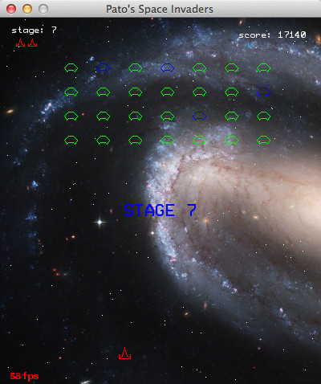
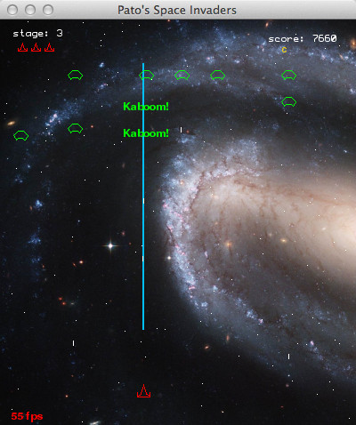

This is implementation of Space Invaders.

Screenshots:
------------

<dl >
  .
  
</dl>

Info:
-----
The game comes with three levels of difficulty, it gets harder as you advance the stages, the player can grab special weapons as you kill aliens, The best at each difficulty level scores are stored. Download the source code as a zip file by clicking [here](https://github.com/harrypotter0/awesome-space-invaders/archive/master.zip)   
Or execute this command from the terminal:   
> git clone https://github.com/harrypotter0/awesome-space-invaders

No rights are reserved, you are free to  build upon my code and make your own version. All resources (font, image, sounds) were obtained freely from the internet.

System requirements:
--------------------
Python (http://www.python.org/) and Pygame (http://www.pygame.org/docs/).

Play:
-----
To start playing, simply open your terminal, go to the directory where the game is located, and type:   
> python space.py

| Controls      | Key           |
| ------------- |:-------------:|
| move left     | left arrow    |
| move right    | right arrow   |
| shoot         | space bar     |
| laser         | x             |
| cluster bomb  | c             |
